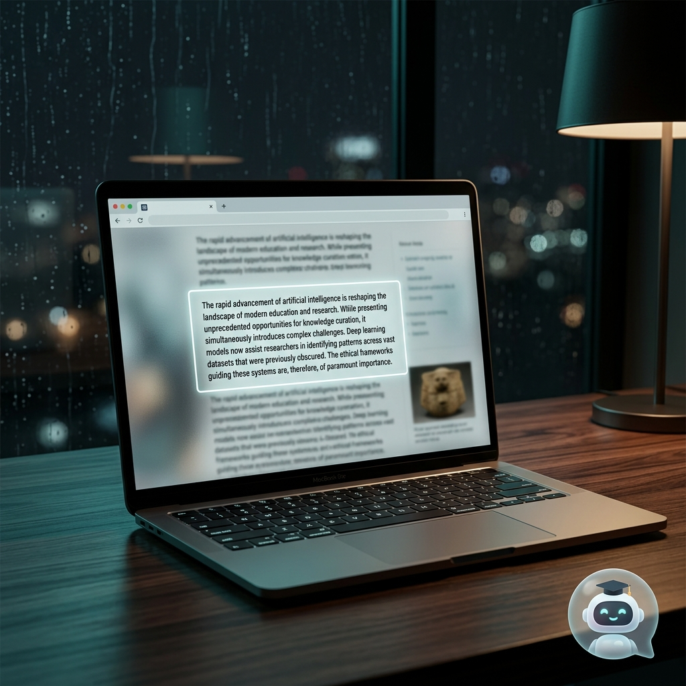

# 🤖 网页伴随式 AI 教练 (Web AI Coach)

一个直接“长”在浏览器右下角的伴随式 AI 助手扩展插件。无需繁琐的切屏和截图，全自动将当前网页元素的可见视图（高清全屏截图）与代码结构（DOM）打包投喂给视觉大模型，让你在浏览网页时能够进行真正的“沉浸式”智能沟通和网页逆向工程。

## ✨ 核心特性

- 💬 **原地智能答疑**: 遇到了看不懂的网页设计与复杂交互？直接在当前页右下角的悬浮面板发起对话。插件会自动提取页面截图，让 AI 结合当前页面“所见即所得”地回答问题。
- 🎨 **一键提取神仙 UI 规范**: 看到好看的页面，一键逆向分析提取对方的设计系统。包括色号（精确到 Hex）、字体体系、圆角阴影，甚至是一键可用（可直接粘贴）的 Tailwind CSS 完整配置源码。
- 📄 **一键反推产生 PRD (逆向产品需求文档)**: 只需 30 秒倒计时，大模型就能通过网页快照反推出网页底层的“心智模型”与“业务逻辑”，为你生成内容详尽、结构清晰的 Markdown 格式的产品需求文档（PRD），还支持一键复制，简直是竞品拆解、抄袭..（划掉）借鉴设计的降维打击利器！
- 🕯️ **雨夜禅意沉浸式阅读**: 开启后，页面其他干扰元素会以雾面玻璃感自然退场，唯有你选择的文字熠熠生辉。配合动态雨声背景，在喧嚣的互联网中为你圈出一块专注的净土。
- 🔧 **支持自定义大模型 API**: 原生支持调用支持 Vision (图片视觉) 功能的大模型（默认支持通义千问 Qwen-VL，你也可以在源码及配置中对接任何符合类似体系的模型 API），并且支持自定义的 System Prompt，任你灵活把玩。

## 🚀 安装指南

目前该插件暂未上架 Chrome Web Store（开发及自用版本）。你可以通过“开发者模式”直接在 Chrome 中加载使用：

1. 克隆或下载本仓库代码到你的本地电脑。
   ```bash
   git clone https://github.com/你的用户名/Web-AI-Coach.git
   ```
2. 打开 Chrome 浏览器的扩展程序页面（在地址栏输入 `chrome://extensions/`）。
3. 在页面右上角，开启 **“开发者模式” (Developer mode)** 开关。
4. 点击左上角的 **“加载已解压的扩展程序” (Load unpacked)** 按钮。
5. 在弹出的本地文件管理器中，选择你刚刚克隆/下载下来的 `AI coach` 文件夹的根目录（即含有 `manifest.json` 的目录）。
6. 安装成功！你可以在插件栏或任何网页中看到专属的机器人气泡。

## ⚙️ 配置说明

为了能够让 AI 视觉能力生效并发起对话、反推 PRD 的功能，你需要前往插件右上角的【设置】页进行以下配置：
1. **API Key 提供**：输入你的远程大模型 API Key（比如通义 Dashscope 的 API Key）。
2. **切换模型**：填写/选择一个支持视觉（Vision）功能的大模型名字（例如 `qwen-vl-plus` 或 `qwen-vl-max` 以获取最好的图片与 UI 识别解析能力）。
3. 测试连接确认无误，即可随时在任意页面上施展魔法！

## 🛠️ 构建与开发

本扩展主要由几个核心模块组成，不需要 Webpack/Vite 同样可以直接运行调试：
- **`manifest.json`**: 插件配置清单 (Manifest V3 架构)。
- **`src/content-script.js`**: 注入到实际网页的执行脚本，负责页面 UI 的注入、进度条展现、DOM 信息的分析反馈，以及用户的交互捕获。
- **`src/background.js`**: 运行于后台的 Service Worker，处理不同网页之间与 Chrome Extension API 的消息通讯，以及请求路由分发。
- **`src/core/remote-client.js`**: 大模型网络请求模块，集成了对图像的压缩处理、结构化 prompt 拼装，并且负责与远程 LLM 服务通讯。
- **`src/ui.css`**: 全局轻量级的拟物+玻璃态美学 CSS 样式控制。

你可以随意 fork 代码，修改 Prompt 根据自己的开发需求去增加任意一键逆推功能。

## 📄 开源协议

本项目基于 [MIT License](LICENSE) 协议开源。你可以自由地使用、修改和分发代码（如果可以的话，欢迎在 Github 赏一个 Star 🎉！）。

---

## 🖼️ 视觉展示 (Showcase)

### 沉浸式阅读模式 (Immersive Reading)

*“世界很吵，但在这里你可以只读这一行。”*
